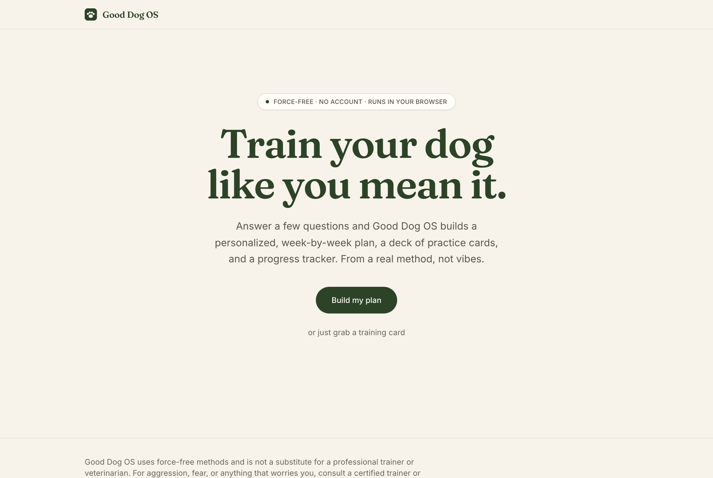
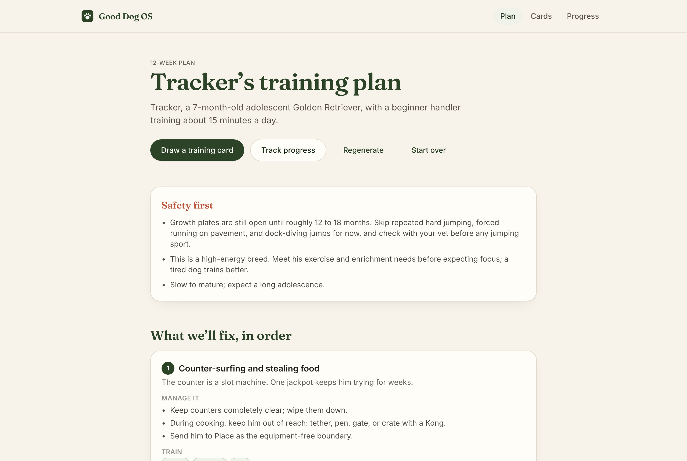
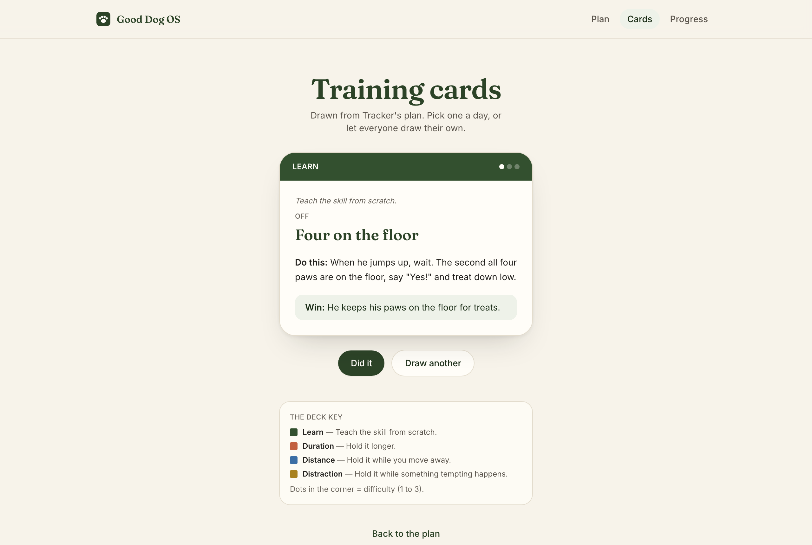
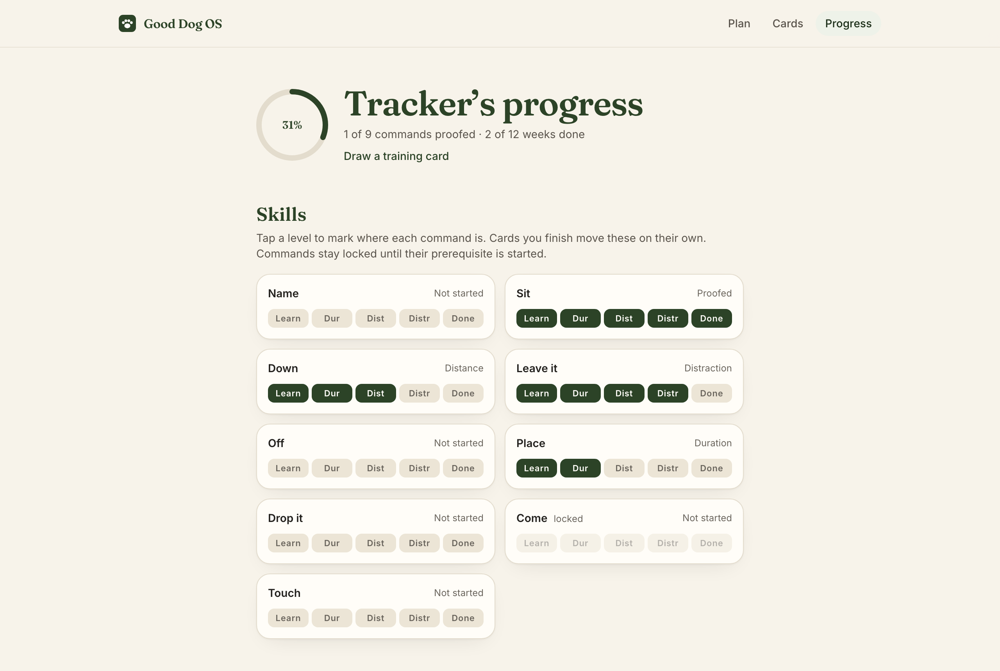

# Good Dog OS

A data-driven dog-training app. Answer a few questions about your dog and it generates a personalized, week-by-week training plan, a deck of practice cards you can print, and a progress tracker. It runs entirely in your browser. No backend, no accounts, no tracking.

**Live demo:** `https://<your-username>.github.io/good-dog-os/` _(enabled once you deploy, see below)_



## About this project

I do not write code. I build products. I built this one by directing Claude (Anthropic's Opus 4.8) across a series of sessions, and I am proud that every commit is co-authored by it. My job was the product: the idea, the architecture decisions, the scope calls, the content, and the design direction. Claude's job was the implementation.

So read this repo as a product and a set of decisions, not as proof that I can hand-write a reducer. What I want it to show is that I can take a vague idea ("train my dog as well as a service dog") and turn it into a coherent, tested, deployable system.

## What it does

- **Onboard** your dog: breed, age, household, the problems you want to fix, time per day, your experience.
- **Generate** a plan: prioritized problems, the commands to teach in order, a week-by-week program scaled to your time and experience, breed and age safety notes, and a "why this plan" rationale.
- **Practice** with training cards: one command, one of the three Ds, one kid-readable challenge. Draw them in the app, or print and cut out the deck.
- **Track** progress: a completion ring, an interactive proofing ladder per command, prerequisite locks, and a week checklist.



| Training cards | Progress tracker |
| --- | --- |
|  |  |

## How it works (the part worth reading)

The interesting decision is that the whole thing is **data plus a pure function**, not a pile of UI:

- **Content as data.** Every command, drill, problem, game, breed, and training card lives in a typed content library under `src/content/`, decoupled from the UI. The same card data drives both the in-app deck and the printable deck, so they never drift.
- **A deterministic generation engine.** `generatePlan(profile, library) => { plan, rationale }` is a pure function: no I/O, no globals, same input always yields the same output. It prioritizes problems, selects and dependency-orders commands, applies breed and age modifiers, sequences the weeks, and returns the reasons behind every choice. That is why it is the most heavily tested part of the codebase, and why there is no LLM in the loop: it is free, instant, offline, and explainable.
- **The loop is connected.** Finishing a training card writes straight into the tracker's proofing ladders. The plan, the deck, and the tracker are one system, not three screens.

### Stack

React + TypeScript + Vite + Tailwind, Zustand for state, Framer Motion for motion, Vitest and Testing Library for tests. State persists to `localStorage` with a versioned schema.

### Key decisions

- **A deterministic engine, not an LLM** — explainable, free, offline, and unit-testable.
- **HashRouter plus a relative build base** — the static build works at any GitHub Pages subpath and survives refreshes with zero server config.
- **Versioned `localStorage`** — a schema-version mismatch is discarded safely instead of crashing a returning user.

## Develop

```bash
npm install
npm run dev      # local dev server
npm test         # unit + component tests
npm run e2e      # playwright end-to-end flow
npm run lint     # eslint
npm run build    # type-check and production build
```

CI runs lint, tests, the build, and the end-to-end flow on every push and pull request (`.github/workflows/ci.yml`).

**Quality:** 59 unit and component tests plus a Playwright end-to-end flow. Lighthouse on the landing page (mobile): **99 performance, 100 accessibility, 100 best practices, 100 SEO**. Fonts are self-hosted, so it loads fast and works offline.

## Printable card deck

```bash
npm run cards:print
```

Renders the card data (`src/content/cards.json`) to a print-ready, cuttable HTML sheet. The in-app deck reads the same file. One source, two surfaces.

## Deploy

Push to `main` and `.github/workflows/deploy.yml` builds and publishes to GitHub Pages. Set the repository's Pages source to "GitHub Actions." The relative base means the repo name is not hardcoded anywhere.

## License

MIT. See [LICENSE](LICENSE).
